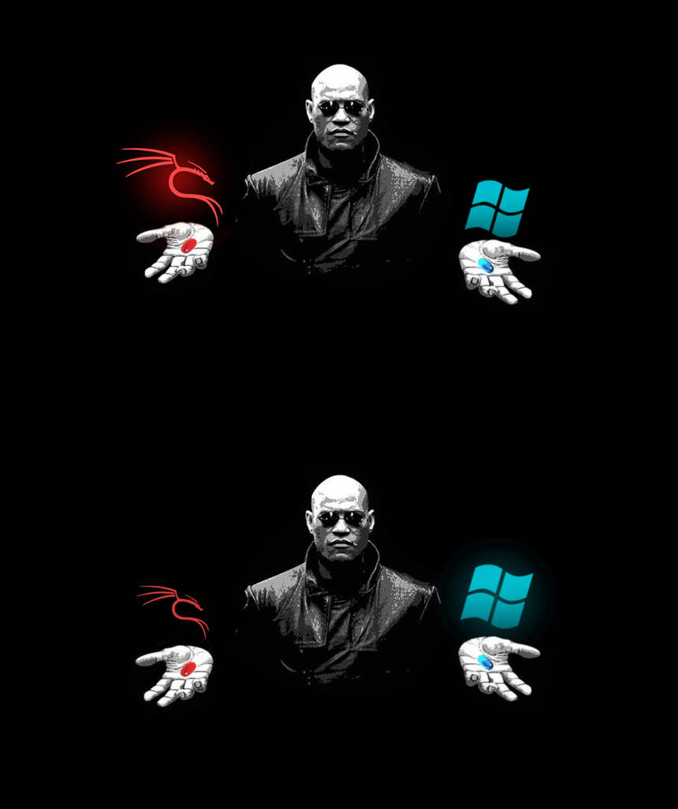

# Matrix Morpheus GRUB Theme — Kali vs Windows
**Red Pill vs Blue Pill**

A minimalist Matrix-inspired GRUB theme featuring full-screen backgrounds that
change between **Kali Linux** and **Windows**. Morpheus offers you the red pill
(Kali, with the red dragon) or the blue pill (Windows).

This is a recolor/relogo of
[Priyank-Adhav/Matrix-Morpheus-GRUB-Theme](https://github.com/Priyank-Adhav/Matrix-Morpheus-GRUB-Theme),
keeping the same colors, layout, and Morpheus artwork — the only change is the
left-hand logo: the Arch "A" has been replaced with the red **Kali dragon**.



*Top: Kali highlighted (dragon glows red). Bottom: Windows highlighted (dragon dim).*

---

**How it works:**
The two boot entries are rendered as full-screen 1920×1080 background images. GRUB
swaps the background depending on which entry is highlighted, so the side you have
selected lights up. You still navigate with the **Up / Down arrow keys** as in a
normal GRUB menu.

GRUB picks the background by matching the menu entry's `--class` to a file in
`Kali/icons/`:

| Boot entry        | GRUB class | Image used            |
|-------------------|-----------|------------------------|
| Kali GNU/Linux    | `kali`    | `icons/kali.png`       |
| Windows           | `windows` | `icons/windows.png`    |

Kali's GRUB entry already carries `--class kali` and Windows' os-prober entry
carries `--class windows`, so no manual class editing is normally needed. If your
icons don't appear, check the `--class` values in `/boot/grub/grub.cfg` and rename
the files in `icons/` to match.

---

## Installation

Run these on your **Kali Linux** install (GRUB lives on the Linux side of a
dual-boot, not on Windows). Copy this folder over to Kali first if you built it
elsewhere.

1. Go into the folder

```shell
cd "Kali and Windows Matrix Morphius GRUB Screen"
```

2. Make the installer executable

```shell
chmod +x install.sh
```

3. Run the installer as root

```shell
sudo ./install.sh
```

4. Reboot to test your new theme

The installer copies the `Kali/` theme folder to `/boot/grub/themes/`, sets
`GRUB_THEME` in `/etc/default/grub`, and regenerates `grub.cfg`
(`grub-mkconfig` / `update-grub`).

### Manual install (if you prefer)

```shell
sudo cp -r Kali /boot/grub/themes/
echo 'GRUB_THEME="/boot/grub/themes/Kali/theme.txt"' | sudo tee -a /etc/default/grub
sudo grub-mkconfig -o /boot/grub/grub.cfg   # or: sudo update-grub
```

---

## Tip: Simplify your GRUB menu

This theme is designed for a **two-entry** layout (Kali + Windows). If your menu
has extra entries such as:

- "Advanced options for Kali GNU/Linux"
- "UEFI Firmware Settings"

…consider hiding the ones you don't use so the red-pill / blue-pill layout stays
clean.

---

## Files

```
Kali/
├── theme.txt          # GRUB theme definition
├── font.pf2           # bundled font
├── icons/
│   ├── kali.png       # full-screen background, Kali highlighted (red dragon glows)
│   └── windows.png    # full-screen background, Windows highlighted
├── os_kali.png        # spare full-res copy of the Kali background
└── os_windows.png     # spare full-res copy of the Windows background
install.sh             # installer
```

---

Original theme by **Priyank-Adhav**. Kali dragon logo © OffSec / Kali Linux.
